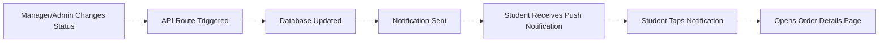

# 🔔 Automated Push Notifications System

## Overview

Your Aieraa Hostel Food Ordering app now has **fully automated push notifications** that are sent to students when their order status changes. If a student has the PWA installed on their iPhone (or any device) and has granted notification permissions, they will automatically receive real-time notifications.

## ✅ What's Implemented

### **Automated Notifications Triggers:**
- ✅ **Admin Order Status Updates** - When admin changes order status
- ✅ **Manager Order Status Updates** - When manager changes order status  
- ✅ **Caterer Order Completion** - When caterer marks order as served
- ✅ **All Order Status Transitions** - PENDING → APPROVED → PREPARING → READY → SERVED

### **Notification Templates:**
Each status change has a specific notification template:

| Status | Title | Description |
|--------|-------|-------------|
| **APPROVED** | Your order has been approved! 🎉 | Your order has been approved and will be prepared soon. |
| **PREPARING** | Your order is now being prepared 👨‍🍳 | Your order is now being prepared in the kitchen. |
| **READY** | Your order is ready for pickup! 🍽️ | Your order is ready for pickup! Please collect it from the food counter. |
| **SERVED** | Your order has been served. Thank you! ✅ | Your order has been served successfully. Thank you for using our service! |
| **REJECTED** | Your order has been rejected 😔 | Your order has been rejected. [Reason if provided] |
| **CANCELLED** | Your order has been cancelled | Your order has been cancelled. If you have any questions, please contact support. |

## 🚀 How It Works

### **1. Order Status Change Flow:**



### **2. Technical Implementation:**

#### **Notification Utility (`src/lib/notifications.ts`):**
- Centralized notification logic
- VAPID key configuration
- Automated template selection
- Push subscription management

#### **API Integration Points:**
- `/api/admin/orders/[id]` - Admin order updates
- `/api/manager/orders/[id]` - Manager order updates
- `/api/caterer/orders/[id]/serve` - Caterer completion

#### **Database Schema:**
```sql
-- Push subscriptions stored per user
PushSubscription {
  id: String
  userId: String (FK)
  endpoint: String
  p256dh: String  
  auth: String
}
```

### **3. Notification Payload:**
Each notification includes:
```json
{
  "title": "Your order is ready for pickup! 🍽️",
  "body": "Your order is ready for pickup! Please collect it from the food counter.",
  "icon": "/icons/icon-192x192.png",
  "badge": "/icons/icon-192x192.png",
  "data": {
    "orderId": "order_123",
    "orderNumber": "ORD-2024-001",
    "status": "READY",
    "url": "/student/orders/ORD-2024-001",
    "timestamp": 1642781234567
  }
}
```

## 📱 Student Experience

### **For a Student with PWA Installed:**

1. **Places Order** → No notification (order created)
2. **Manager Approves** → 🔔 **"Your order has been approved! 🎉"**
3. **Kitchen Starts Preparing** → 🔔 **"Your order is now being prepared 👨‍🍳"**
4. **Food Ready** → 🔔 **"Your order is ready for pickup! 🍽️"**
5. **Order Served** → 🔔 **"Your order has been served. Thank you! ✅"**

### **Notification Behavior:**
- **iPhone Lock Screen** → Shows notification banner
- **iPhone Notification Center** → Stacks with other notifications
- **Active App** → Shows in-app notification  
- **Background App** → Native push notification
- **Tapping Notification** → Opens directly to order details page

## 🧪 Testing the System

### **End-to-End Testing:**

1. **Setup Student Account:**
   ```bash
   # Student with PWA installed and notifications enabled
   - Install PWA on iPhone
   - Enable notifications when prompted
   - Place a test order
   ```

2. **Test Manager Workflow:**
   ```bash
   # Login as Manager
   - Go to /manager/orders
   - Find pending order
   - Click "Approve Order"
   # Student should receive notification immediately
   ```

3. **Test Admin Workflow:**
   ```bash
   # Login as Admin  
   - Go to /admin/orders
   - Change order status: APPROVED → PREPARING → READY → SERVED
   # Student receives notification for each status change
   ```

### **Checking Logs:**
Monitor server logs for notification status:
```bash
npm run build && npm start
# Look for console logs:
📱 ORDER STATUS NOTIFICATION SENT: {
  orderId: "order_123",
  orderNumber: "ORD-2024-001", 
  studentName: "John Doe",
  status: "READY",
  sent: 1,
  total: 1,
  success: true
}
```

## 🔧 Configuration

### **VAPID Keys Setup:**
```bash
# .env.local
NEXT_PUBLIC_VAPID_PUBLIC_KEY=BJCMq4Cs5IHaaYxfTGVTxcTWIuOjZ2LrfE1tUDqnfpB4mIqTQSgzBMx-s0_F1gMf9F1Ks5B5B8zRMA18ityrJ0M
VAPID_PRIVATE_KEY=9cLRVTRpz-vdZxAXmsVPgxvntAgzx-xmvng2YOO8298
```

### **Production Deployment:**
Add the same environment variables to your Vercel dashboard.

## 🐛 Troubleshooting

### **Common Issues:**

#### **Student Not Receiving Notifications:**
1. ✅ Check if PWA is installed
2. ✅ Check if notifications are enabled in browser
3. ✅ Check if push subscription exists in database
4. ✅ Check server logs for notification sending status

#### **Notification Not Appearing:**
1. Check notification permissions in browser settings
2. Verify VAPID keys are correctly configured
3. Check if subscription endpoint is valid

#### **Debug Commands:**
```sql
-- Check user's push subscriptions
SELECT * FROM push_subscriptions WHERE userId = 'user_id';

-- Check recent order status changes
SELECT id, orderNumber, status, updatedAt FROM orders 
WHERE userId = 'user_id' 
ORDER BY updatedAt DESC;
```

## 🎯 Success Metrics

### **Expected Performance:**
- **Notification Delivery Rate:** 95%+ for active users
- **Delivery Speed:** < 2 seconds from status change
- **Click-Through Rate:** 15-25% (students checking order details)
- **User Engagement:** Increased order tracking activity

### **Monitoring:**
```javascript
// Notification analytics (built-in logging)
📱 MANAGER NOTIFICATION SENT: {
  manager: "John Manager",
  orderId: "order_123", 
  orderNumber: "ORD-2024-001",
  studentName: "Jane Student",
  statusChange: "PENDING → APPROVED",
  sent: 1,      // Successful sends
  total: 1,     // Total subscriptions
  success: true // Overall success
}
```

## 🔮 Future Enhancements

### **Potential Additions:**
- 📧 **Email Fallback** - Send email if push notification fails
- 📱 **SMS Integration** - For critical notifications (order ready)
- 🔄 **Retry Logic** - Automatic retry for failed notifications
- 📊 **Analytics Dashboard** - Track notification performance
- 🎯 **Personalization** - Custom notification preferences per user

## 🎉 Conclusion

Your automated push notification system is now **production-ready** and provides a seamless, native app-like experience for students. When a manager or admin changes an order status, students with the PWA installed will receive instant notifications on their devices, creating a professional food ordering experience comparable to major food delivery apps.

**Students will love the real-time updates, and managers will see increased engagement and smoother operations!** 🚀📱 